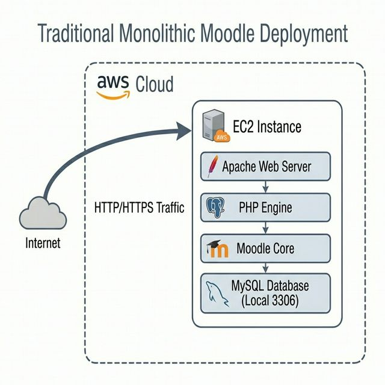
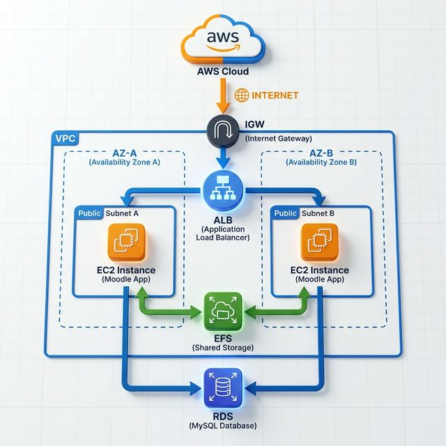

# Bytemind-IaC: Moodle High Availability on AWS 🚀🛡️

   

**Proyecto Fin de Grado (TFG)** enfocado en la excelencia operativa: transformando un despliegue **Moodle Monolítico** convencional en una arquitectura **descentralizada, resiliente y escalable** en la nube de AWS mediante Infrastructure as Code (IaC).

---

## 🏛️ Evolución de la Ingeniería: Del Monolito a la Alta Disponibilidad
Este proyecto documenta el salto tecnológico necesario para mover aplicaciones académicas a entornos de producción de grado empresarial.

### 🔴 Antes: Arquitectura Monolítica (Standard Moodle)
*Infraestructura básica con punto único de fallo. Todos los servicios (Web, DB, Files) conviven en una única instancia EC2.*



### 🟢 Después: Arquitectura Bytemind HA (Bytemind-IaC Design)
*Propuesta de grado empresarial con capas desacopladas, persistencia externa y redundancia Multi-AZ.*



---

## 🏗️ Showcase: Arquitectura de Ingeniería Validada
*Diagrama técnico final detallado, validado mediante Chaos Engineering y pruebas de carga intensivas.*


---

## 🛠️ Retos Técnicos y Soluciones de Ingeniería
El proyecto resuelve desafíos críticos del Well-Architected Framework:

| Categoría | Desafío Técnico | Solución Implementada |
| :--- | :--- | :--- |
| **Disponibilidad** | Eliminar puntos de fallo únicos (SPOF). | Despliegue Multi-AZ con Auto Scaling y Balanceador (ALB). |
| **Persistencia** | Sincronización de contenidos entre nodos. | Desacoplamiento de datos con RDS MySQL y archivos con EFS. |
| **Resiliencia** | Recuperación ante fallos críticos. | Automatización SRE: Self-Healing validado con Chaos Testing. |
| **FinOps** | Optimización de costes en infraestructura. | Arquitectura efímera: Despliegue bajo demanda y destrucción total. |
| **Automatización** | Despliegue "Zero-Touch" en AWS. | Configuración dinámica de Moodle vía Terraform y User-Data. |

---

## 📂 Estructura del Proyecto
*   **[`/`](./):** Código Terraform **Golden-Stable (V18)**.
*   **[`docs/`](./docs/):** Memoria técnica, diagramas Mermaid y [galería de alta fidelidad](./docs/architecture_visuals.md).
*   **[`archive/`](./archive/):** Histórico de desarrollo y versiones heredadas.

## 🚀 Despliegue y Acceso
```bash
terraform init
terraform apply
```
Una vez desplegado, el sistema genera automáticamente un **Moodle URL** (vía Outputs) accesible de forma inmediata.

---
**David Arbelaez Mutis - TFG Bytemind-IaC (2026)**
*"Automatizando la educación, asegurando el mañana."*

<a href="https://www.linkedin.com/in/davidmutis/" target="_blank">
  
</a>
