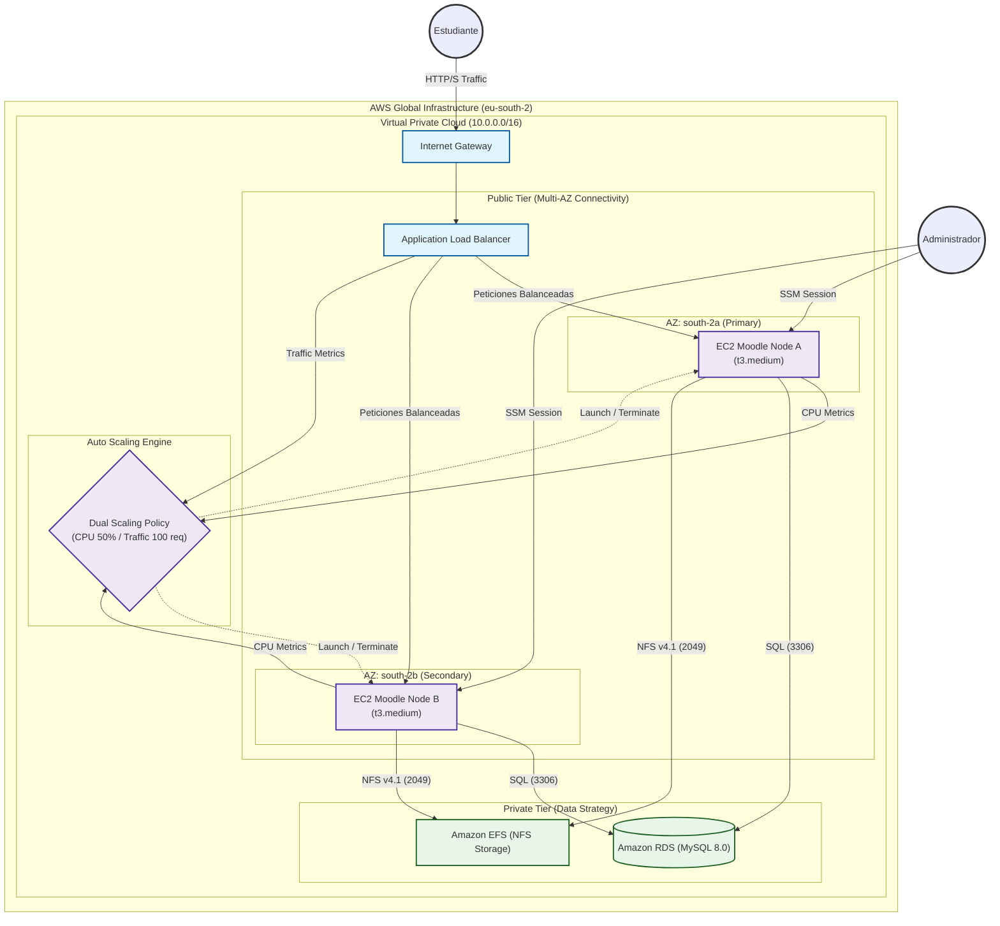

# Arquitectura de Sistemas: Moodle High Availability (Bytemind-IaC)

Esta arquitectura representa el diseño consolidado tras la Fase de Recuperación V18 y la Validación de Alta Disponibilidad.

---

## 🚀 Evolución: Del Monolito a la Descentralización

Un punto clave del TFG es la transición desde un despliegue tradicional hacia uno de grado empresarial.

### 🔴 Antes: Arquitectura Monolítica (Standard Moodle)
En un despliegue básico, todos los componentes conviven en un único servidor:
- **Punto Único de Fallo:** Si la instancia EC2 falla, todo el sistema cae.
- **Escalabilidad Nula:** Para crecer, hay que aumentar el tamaño de la máquina (Escalado Vertical), lo cual es costoso y requiere tiempo de inactividad.
- **Riesgo de Datos:** La base de datos y los archivos están dentro del servidor; si el disco se corrompe, los datos se pierden.

### 🟢 Después: Arquitectura Bytemind HA (Descentralizada)
Nuestra solución desacopla las responsabilidades para maximizar la resiliencia:
- **Cómputo Inmutable:** Las instancias EC2 son efímeras. Si una muere, el ASG lanza otra idéntica automáticamente.
- **Persistencia Externa:** Los datos viven en servicios gestionados (**RDS** y **EFS**) inmunes a fallos de los servidores de aplicaciones.
- **Alta Disponibilidad:** Tráfico distribuido por el **ALB** entre múltiples centros de datos (AZ).

## 🛠️ Especificaciones de la Infraestructura
| Componente | Capa | Resiliencia | Notas de TFG |
| :--- | :--- | :--- | :--- |
| **ALB** | Networking | Distribuido | Punto único de terminación SSL (Fase 4). |
| **ASG** | Cómputo | Auto-Healing | Recuperó la flota automáticamente en el Chaos Test. |
| **RDS** | Datos | Gestionado | Backups automatizados y aislamiento en subred privada. |
| **EFS** | Almacenamiento | Multi-AZ | Punto de montaje común para sesiones y archivos. |

## 🛡️ Hitos de Ingeniería Digital (V18)
1.  **Aislamiento de Seguridad:** Ninguna instancia EC2 tiene IP pública directa; todo el tráfico pasa por el ALB.
2.  **Despliegue Inmutable:** El `config.php` se autoconfigura en el arranque para evitar errores de conexión.
3.  **FinOps Strategy:** El entorno está diseñado para ser **efímero**. Se despliega para exámenes/clases y se destruye (`Destroy`) al finalizar, ahorrando el 100% del coste residual.
