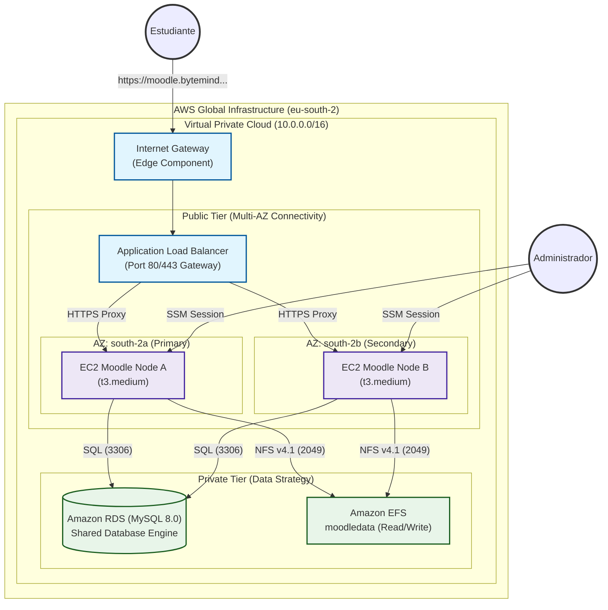

# Arquitectura de Sistemas: Moodle High Availability (Bytemind-IaC)

Esta arquitectura representa el diseño consolidado tras la Fase de Recuperación V18 y la Validación de Alta Disponibilidad.

```mermaid
graph TB
    %% --- ESTILOS PROFESIONALES ---
    classDef cloud fill:#f1f2f3,stroke:#3498db,stroke-width:2px,stroke-dasharray: 5 5;
    classDef network fill:#e1f5fe,stroke:#01579b,stroke-width:2px;
    classDef compute fill:#ede7f6,stroke:#4527a0,stroke-width:2px;
    classDef storage fill:#e8f5e9,stroke:#1b5e20,stroke-width:2px;
    classDef user stroke:#333,stroke-width:3px;

    %% --- ACTORES ---
    Alumno((Estudiante)):::user
    Admin((Administrador)):::user

    subgraph "AWS Global Infrastructure (eu-south-2)"
        subgraph "Virtual Private Cloud (10.0.0.0/16)"
            direction TB
            IGW["Internet Gateway<br/>(Edge Component)"]:::network
            
            subgraph "Public Tier (Multi-AZ Connectivity)"
                ALB["Application Load Balancer<br/>(Port 80/443 Gateway)"]:::network
                
                subgraph "AZ: south-2a (Primary)"
                    EC2_A["EC2 Moodle Node A<br/>(t3.medium)"]:::compute
                end

                subgraph "AZ: south-2b (Secondary)"
                    EC2_B["EC2 Moodle Node B<br/>(t3.medium)"]:::compute
                end
            end

            subgraph "Private Tier (Data Strategy)"
                RDS[("Amazon RDS (MySQL 8.0)<br/>Shared Database Engine")]:::storage
                EFS["Amazon EFS<br/>moodledata (Read/Write)"]:::storage
            end
        end
    end

    %% --- FLUJO DE DATOS ---
    Alumno -- "https://moodle.bytemind..." --> IGW
    IGW --> ALB
    
    ALB -- "HTTPS Proxy" --> EC2_A
    ALB -- "HTTPS Proxy" --> EC2_B
    
    EC2_A -- "SQL (3306)" --> RDS
    EC2_B -- "SQL (3306)" --> RDS
    
    EC2_A -- "NFS v4.1 (2049)" --> EFS
    EC2_B -- "NFS v4.1 (2049)" --> EFS

    Admin -- "SSM Session" --> EC2_A
    Admin -- "SSM Session" --> EC2_B

    %% --- CLASES DE ESTILO ---
    class IGW,ALB network;
    class EC2_A,EC2_B compute;
    class RDS,EFS storage;
```

---

## 🚀 Evolución: Del Monolito a la Descentralización

Un punto clave del TFG es la transición desde un despliegue tradicional hacia uno de grado empresarial.

### 🔴 Antes: Arquitectura Monolítica (Standard Moodle)
En un despliegue básico, todos los componentes conviven en un único servidor:
- **Punto Único de Fallo:** Si la instancia EC2 falla, todo el sistema cae.
- **Escalabilidad Nula:** Para crecer, hay que aumentar el tamaño de la máquina (Escalado Vertical), lo cual es costoso y requiere tiempo de inactividad.
- **Riesgo de Datos:** La base de datos y los archivos están dentro del servidor; si el disco se corrompe, los datos se pierden.

### 🟢 Después: Arquitectura Bytemind HA (Descentralizada)
Nuestra solución desacopla las responsabilidades para maximizar la resiliencia:
- **Cómputo Inmutable:** Las instancias EC2 son efímeras. Si una muere, el ASG lanza otra idéntica automáticamente.
- **Persistencia Externa:** Los datos viven en servicios gestionados (**RDS** y **EFS**) inmunes a fallos de los servidores de aplicaciones.
- **Alta Disponibilidad:** Tráfico distribuido por el **ALB** entre múltiples centros de datos (AZ).

## 🛠️ Especificaciones de la Infraestructura
| Componente | Capa | Resiliencia | Notas de TFG |
| :--- | :--- | :--- | :--- |
| **ALB** | Networking | Distribuido | Punto único de terminación SSL (Fase 4). |
| **ASG** | Cómputo | Auto-Healing | Recuperó la flota automáticamente en el Chaos Test. |
| **RDS** | Datos | Gestionado | Backups automatizados y aislamiento en subred privada. |
| **EFS** | Almacenamiento | Multi-AZ | Punto de montaje común para sesiones y archivos. |

## 🛡️ Hitos de Ingeniería Digital (V18)
1.  **Aislamiento de Seguridad:** Ninguna instancia EC2 tiene IP pública directa; todo el tráfico pasa por el ALB.
2.  **Despliegue Inmutable:** El `config.php` se autoconfigura en el arranque para evitar errores de conexión.
3.  **FinOps Strategy:** El entorno está diseñado para ser **efímero**. Se despliega para exámenes/clases y se destruye (`Destroy`) al finalizar, ahorrando el 100% del coste residual.
