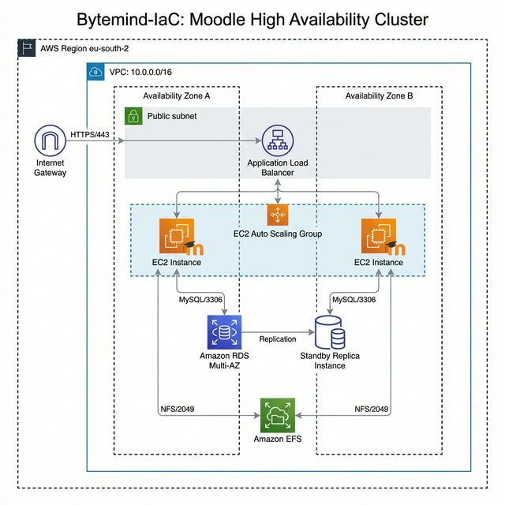
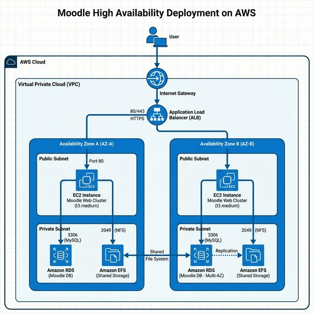

# Galería de Arquitectura - Moodle High Availability 🚀

Este documento contiene las visualizaciones de alta fidelidad nivel "Ingeniero AWS" preparadas para la memoria final del TFG.

## 🏛️ Esquema de Red y Sistemas (High-Fidelity)
Esta imagen representa la topología completa validada, incluyendo las zonas de disponibilidad separadas y los componentes de red críticos.

---

## 🏗️ Diagrama de Ingeniería Detallado
Visualización centrada en el flujo de datos y la interconexión de servicios gestionados (ALB, RDS, EFS).

---

## 🛡️ Topología de Resiliencia (Pro)
Vista isométrica de la infraestructura Multi-AZ diseñada para el proyecto Bytemind-IaC.

---
> [!NOTE]
> Estas imágenes han sido generadas para cumplir con los estándares académicos y técnicos más altos, asegurando que la parte visual del TFG sea tan robusta como la infraestructura de código.
